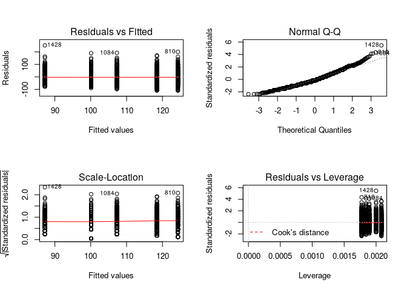

RStudio Data Visualization of Blocking Effects
==============================================

Visualizing Distribution of Three Growth Variables
--------------------------------------------------

    # reading in my csv with all the data
    data <- read.csv("OakGrowthData1.csv")

    # seperate the data between the two gardens, so each can be controlled seperately 
    IFG <- subset(x = data, Site == "IFG")
    Chico <- subset(x = data, Site == "Chico")

    # making a 3 by 3 window for all 9 histograms to be viewed in together
    par(mfrow = c(3,3))

    # histograms for the entire data set
    hist(data$Height, xlab = "Height", main = "Data-Height")
    hist(data$Leaves, xlab = "Log of Leaves", main = "Data-Leaves")
    hist(data$Branches, xlab = "Branches", main = "Data-Branches")

    # histograms for Placerville data, colored blue
    hist(IFG$Height, col = "blue", xlab = "Height", main = "Placerville-Height")
    hist(IFG$Leaves, col = "blue", xlab = "Log of Leaves", main ="Placerville-Leaves")
    hist(IFG$Branches, col = "blue", xlab = "Branches", main = "Placerville-Branches")

    # histograms for Chico data, colored green
    hist(Chico$Height, col = "green", xlab = "Height", main = "Chico-Height")
    hist(Chico$Leaves, col = "green", xlab = "Log of Leaves", main = "Chico-Leaves")
    hist(Chico$Branches, col = "green", xlab = "Branches", main = "Chico-Branches")

Creating New Data for Controlled Blocking Effect in Placerville
---------------------------------------------------------------

    # Creating graph for Placerville-Height seperated by block
    IFGBlockHeight <- lm(IFG$Height ~ as.factor(IFG$Block), data = IFG)
    par(mfrow = c(2,2))
    plot(IFGBlockHeight)

    # appending residuals+mean to Placerville data
    IFG[,12] <- ((IFGBlockHeight$residuals)+mean(IFG$Height))

    # Creating graph for Placerville-Leaves seperated by block
    IFGBlockLeaves <- lm(IFG$Leaves ~ as.factor(IFG$Block), data = IFG)
    par(mfrow = c(2,2))
    plot(IFGBlockLeaves)

    # appending residuals+mean to Placerville data
    IFG[,13] <- ((IFGBlockLeaves$residuals)+mean(IFG$Leaves))

    # Creating graph for Placerville-Branches seperated by block
    IFGBlockBranches <- lm(IFG$Branches ~ as.factor(IFG$Block), data = IFG)
    par(mfrow = c(2,2))
    plot(IFGBlockBranches)

    # appending residuals+mean to Placerville data
    IFG[,14] <- ((IFGBlockBranches$residuals)+mean(IFG$Branches))

    # re-naming new columns for clarity
    colnames(IFG)[colnames(IFG)=="V12"] <- "NewHeight"
    colnames(IFG)[colnames(IFG)=="V13"] <- "NewLeaves"
    colnames(IFG)[colnames(IFG)=="V14"] <- "NewBranches"

Creating New Data for Controlled Blocking Effect in Chico
---------------------------------------------------------

    # Creating graph for Chico-Height seperated by block
    ChicoBlockHeight <- lm(Chico$Height ~ as.factor(Chico$Block), data = Chico)
    par(mfrow = c(2,2))
    plot(ChicoBlockHeight)

    # appending residuals+mean to Chico data
    Chico[,12] <- ((ChicoBlockHeight$residuals)+mean(Chico$Height))

    # Creating graph for Chico-Leaves seperated by block
    ChicoBlockLeaves <- lm(Chico$Leaves ~ as.factor(Chico$Block), data = Chico)
    par(mfrow = c(2,2))
    plot(ChicoBlockLeaves)

    # appending residuals+mean to Chico data
    Chico[,13] <- ((ChicoBlockLeaves$residuals)+mean(Chico$Leaves))

    # Creating graph for Chico-Branches seperated by block
    ChicoBlockBranches <- lm(Chico$Branches ~ as.factor(Chico$Block), data = Chico)
    par(mfrow = c(2,2))
    plot(ChicoBlockBranches)

    # appending residuals+mean to Chico data
    Chico[,14] <- ((ChicoBlockBranches$residuals)+mean(Chico$Branches))

    # re-naming new columns for clarity 
    colnames(Chico)[colnames(Chico)=="V12"] <- "NewHeight"
    colnames(Chico)[colnames(Chico)=="V13"] <- "NewLeaves"
    colnames(Chico)[colnames(Chico)=="V14"] <- "NewBranches"

Creating a New Data Set with Controlled Values Appended
-------------------------------------------------------

    # attaching the seperated data into a combined format with controlled values
    data2 <- rbind(IFG, Chico)

    # now I will output this as a new data file
    write.csv(data2, "~/Downloads/Block-Controlled-Data.csv", append = F, quote = F, sep = ",")

    ## Warning in write.csv(data2, "~/Downloads/Block-Controlled-Data.csv", append
    ## = F, : attempt to set 'append' ignored

    ## Warning in write.csv(data2, "~/Downloads/Block-Controlled-Data.csv", append
    ## = F, : attempt to set 'sep' ignored
